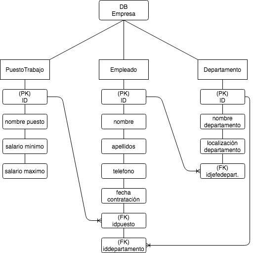

# laravelPracticaBDConnect
Una practica dedicada a la la comunicación a la base de datos y manejar sus datos por medio del framework de laravel.

# Enunciado ejercicio Empresa-Modelo
~~~
Empleado:
PK(id)-(nombre, apellidos, email, telefono, fecha_contratacion), FK(idpuesto), FK(iddepartamento)

PuestoTrabajo:
PK(id)-(nombre del puesto, salario minimo del puesto, salario maximo del puesto)

Departamento:
PK(id)-(nombre del departamento, localizacion del departamento) y FK(id - jefe de departamento)

~~~
- Cada **Empleado** ocupa un **PuestoTrabajo**

- Cada **Empleado** pertenece a un **Departamento**

#### implementar controladores de recursos para los tres modelos.

### Aclaraciones

#### Dado el **Departamento** poder obtener todos los empleados que trabajan en él.
---

